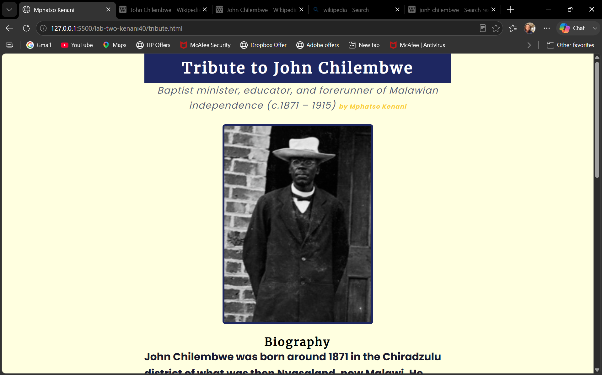

# Lab 2 Error Log

**Student Name:** Mphatso Kenani

**Student ID:** BECE/21/SS/009

**Date:** 09 August 2026

**Lab Session:** 8:00am - 12:30pm
---

## Error 1

**Task I was working on:** Task 1
I forget the ./css/ prefix and styles were not appllying fixed by completing the source path "./css/style.css"

## Error 2

**Task I was working on:** Task 3
forgot % signs in hsl(232, 53, 25), color silently failed to apply, fixed by adding % to hsl(232, 53%, 25%)

## Error 3

**Task I was working on:** Task 5
tribute image did not display, broken image icon shown, forgot to copy the full Wikimedia Commons URL and had a typo in the filename, fixed by copying the exact "Copy image address" link

---

## Session Reflection

**The concept I found hardest to understand today:**
Understanding why the browser sometimes drops a style silently (like the bad HSL value) instead of showing a clear error 

**One question I still have:**
When a font fails to load offline and falls back to Arial, is there a way to detect that failure in code so I could show the user a message, or does the browser just silently substitute it with no way to know?

**My browser output screenshot filename:** 